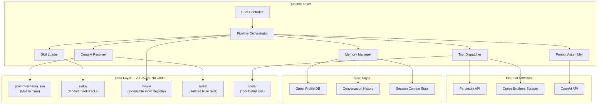
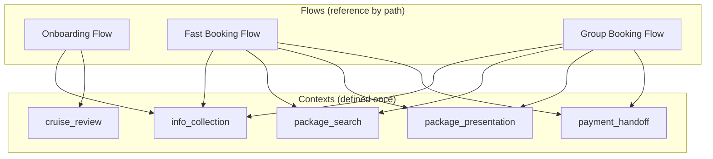
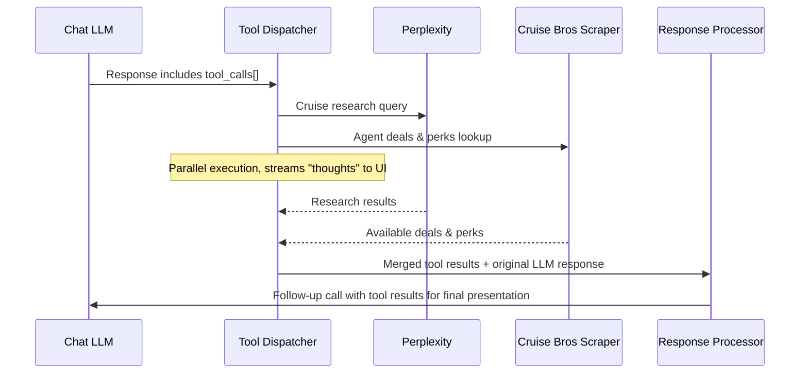

# Chat System Blueprint: Structured Prompt System & Chat Flow Pipeline

> [!NOTE]
> This is an **architectural blueprint** — no code changes yet. Once approved, this becomes the implementation guide for building the chat engine.

---

## 1. The Problem

Your vision calls for a chat system that:
- Guides conversations through **hundreds of branching contexts** without losing focus
- Keeps **all prompt logic in external JSON/files** — zero hardcoded instructions in code
- Allows devs to **hot-edit prompt behavior** without redeploying
- Supports **modular "Agent Skills"** that load/unload dynamically
- Feeds into an **extensible Chat Flow registry** — drop a JSON file to add a new flow
- Collects structured guest data (`GUEST_INFO.json`) conversationally over time
- Works identically across **Text, Voice, and future channels**

The existing `CHANNEL_UNIFIED_AGENT_RUNBOOK.md` solved channel parity but used a flat prompt assembly approach. This blueprint replaces that with a **hierarchical, tree-structured prompt system**.

---

## 2. Architecture Overview




---

## 3. The Structured Prompt System

### 3.1 — Master Prompt Schema (`prompt-schema.json`)

A single JSON tree that defines **every context the agent can operate in**. The agent never freelances — it always operates within a resolved node of this tree.

```json
{
  "schema_version": "1.0",
  "root": {
    "identity": {
      "name": "LL Cruise Buddy",
      "persona_ref": "skills/persona.md",
      "global_rules": [
        "Never fabricate cruise pricing",
        "Always confirm before collecting PII",
        "Use Agent Perks when it will help close"
      ]
    },
    "contexts": {
      "onboarding": {
        "priority": 1,
        "trigger": "new_user OR incomplete_profile",
        "instructions": [
          "Build trust before requesting sensitive data",
          "Start with travel history, not personal info"
        ],
        "sub_contexts": {
          "cruise_experienced": {
            "trigger": "user_has_cruised == true",
            "instructions_ref": "skills/onboarding/cruise-review.md",
            "data_targets": ["preferences.vibe", "preferences.dining"]
          },
          "cruise_novice": {
            "trigger": "user_has_cruised == false",
            "instructions_ref": "skills/onboarding/travel-review.md",
            "data_targets": ["preferences.vibe", "logistics.departure_port"]
          }
        }
      },
      "fast_booking": {
        "priority": 2,
        "trigger": "user_requests_specific_cruise",
        "instructions_ref": "skills/booking/fast-flow.md",
        "required_data": ["travelers[0].legal_first_name", "financials.budget_per_person"],
        "sub_contexts": {
          "info_collection": { "...": "..." },
          "package_search": { "...": "..." },
          "package_presentation": { "...": "..." },
          "payment_handoff": { "...": "..." }
        }
      },
      "cruise_review": {
        "priority": 5,
        "trigger": "user_discusses_past_cruise",
        "instructions_ref": "skills/review/past-cruise.md"
      },
      "active_voyage": {
        "priority": 3,
        "trigger": "user_on_active_booking",
        "instructions_ref": "skills/voyage/onboard-assistant.md"
      },
      "post_voyage": {
        "priority": 6,
        "trigger": "user_completed_cruise",
        "instructions_ref": "skills/voyage/post-cruise.md"
      }
    }
  }
}
```

**Key design decisions:**
- **`priority`** — When multiple contexts match, highest priority wins
- **`trigger`** — Evaluated programmatically against session state (NOT by the LLM)
- **`instructions_ref`** — Complex instructions live in markdown files, referenced by pointer
- **`data_targets`** — Tells the Memory Manager which `GUEST_INFO.json` fields this context aims to populate
- **`required_data`** — Fields that MUST be collected before progressing (enforced by code, not prompt)

### 3.2 — Shared Context Pool (No Duplication)

Contexts are defined **once** in `prompt-schema.json` and referenced **by path** from any flow. Flows never duplicate context definitions.



A flow stage references a context by its **dot-path** (e.g., `"context": "fast_booking.info_collection"`). Shared contexts like `info_collection` and `package_search` are reused across flows — onboarding can transition into package search the same way fast booking does, using the same context node.

> [!IMPORTANT]
> If you need `info_collection` behavior in both Onboarding and Fast Booking, both flows point to the **same context node** in the tree. One definition, many consumers.

### 3.3 — Rules as Isolated Modules (`rules/`)

Each rule set is an independent JSON file that can be amended without touching anything else:

```
rules/
├── wheelchair-accessibility.json
├── minor-travelers.json
├── passport-requirements.json
├── dietary-restrictions.json
├── loyalty-programs.json
└── agent-perks-policy.json
```

Example `wheelchair-accessibility.json`:
```json
{
  "rule_id": "wheelchair_access",
  "applies_when": "logistics.mobility_needs.wheelchair_accessible_cabin == true",
  "inject_instructions": [
    "Only suggest ships with ADA-compliant cabins",
    "Confirm wheelchair storage and ramp access at ports",
    "Flag excursions that are NOT wheelchair accessible"
  ]
}
```

Rules are **injected** into the assembled prompt by the Context Resolver when their `applies_when` condition is met. They never conflict because they are additive.

### 3.4 — Agent Skills (`skills/`)

Reusable instruction packs the agent can load based on the active context:

```
skills/
├── persona.md                    # Core identity & voice
├── onboarding/
│   ├── cruise-review.md          # Questions for experienced cruisers
│   ├── travel-review.md          # Questions for cruise novices
│   └── trust-building.md         # Early relationship protocols
├── booking/
│   ├── fast-flow.md              # Fast booking conversation guide
│   ├── package-search.md         # How to search & filter packages
│   └── package-presentation.md   # How to present options in chat
├── review/
│   └── past-cruise.md            # Deep-dive into past experiences
├── voyage/
│   ├── onboard-assistant.md      # During-cruise help (excursions, dining)
│   └── post-cruise.md            # Post-trip follow-up & claims
└── data-collection/
    ├── pii-collection.md         # Secure info gathering protocols
    └── preference-mining.md      # Extracting preferences from conversation
```

---

## 4. Tool Registry (External Research & Package Construction)

Cruise research, pricing discovery, and package construction are **offloaded to specialized external tools** — not handled by the main chat LLM. The pipeline dispatches tool calls and weaves results back into the conversation.

### 4.1 — Tool Definitions (`tools/`)

Each tool is a JSON definition + a TypeScript handler. Adding a new tool = drop a JSON file + handler.

Three tool categories:

```
tools/
├── research/                              # Market intelligence
│   ├── perplexity-cruise-research.json    # Cruise availability, pricing, hidden deals
│   ├── social-media-insights.json         # YouTube, TikTok, X, Instagram cruise reviews
│   └── excursion-finder.json              # Port excursion research
├── agency/                                # Cruise Brothers business tools
│   ├── cruise-brothers-knowledge.json     # Agent docs, policies, commissions, supplier portals
│   ├── cruise-brothers-scraper.json       # Live deals, specials, Agent Perks
│   └── pricing-comparator.json            # Cross-line price comparison
└── construction/                          # Package assembly
    └── package-builder.json               # Combine research + agency data into bookable packages
```

#### Cruise Brothers Knowledge Base (`cruise-brothers-knowledge.json`)

A dedicated tool for ingesting and querying **all Cruise Brothers agent-critical documents**: supplier portal guides, commission schedules, booking procedures, preferred vendor lists, CLIA/IATA policies, and the Agent Perks program.

```json
{
  "tool_id": "cruise_brothers_knowledge",
  "display_name": "Cruise Brothers Agent Knowledge Base",
  "description": "Query agent docs, policies, commission schedules, supplier portal procedures, and Agent Perks program",
  "handler": "lib/chat/tools/cruise-brothers-knowledge.ts",
  "available_in_contexts": ["*"],
  "knowledge_sources": [
    "Cruise Brothers Agent Handbook",
    "Supplier Portal Procedures (CruisingPower, Espresso, etc.)",
    "Commission Schedules by Cruise Line",
    "Agent Perks Program Details",
    "CLIA/IATA Compliance Requirements",
    "Preferred Vendor Agreements"
  ],
  "thoughts_stream_label": "Checking Cruise Brothers agent resources..."
}
```

#### Social Media Cruise Insights (`social-media-insights.json`)

Scrapes and analyzes real customer cruise reviews from social platforms for deep preference matching and package validation:

```json
{
  "tool_id": "social_media_insights",
  "display_name": "Social Media Cruise Intelligence",
  "description": "Analyze YouTube cruise review transcripts, TikTok reviews, X posts, and Instagram content for real customer insights",
  "handler": "lib/chat/tools/social-media-insights.ts",
  "available_in_contexts": ["fast_booking.package_search", "onboarding.cruise_experienced"],
  "input_schema": {
    "cruise_line": "string",
    "ship_name": "string | null",
    "destination": "string | null",
    "platforms": ["youtube", "tiktok", "x", "instagram"]
  },
  "output_schema": {
    "youtube_transcripts": "ReviewSummary[]",
    "social_sentiment": "SentimentAnalysis",
    "common_complaints": "string[]",
    "common_highlights": "string[]"
  },
  "thoughts_stream_label": "Analyzing real cruise reviews..."
}
```

### 4.2 — How Tools Integrate with the Pipeline



The LLM **decides when to call tools** via structured `tool_calls` in its response, but the **Tool Dispatcher** handles all execution. The chat LLM never calls Perplexity directly — it requests the tool, gets results back, and formats a response for the user.

### 4.3 — Tool Handler Pattern

Each handler follows a strict interface:

```typescript
// lib/chat/tools/perplexity-research.ts
// Handler implements ToolHandler interface from types.ts
// Input: PerplexityCruiseResearchInput (validated against tool JSON schema)
// Output: PerplexityCruiseResearchOutput
// Streams progress events to ThoughtsWidget via callback
```

### 4.4 — Adding a New Tool (Developer Workflow)

1. Create `tools/my-new-tool.json` with schema definition
2. Create `lib/chat/tools/my-new-tool.ts` implementing the handler interface
3. Add the tool's `tool_id` to relevant contexts in `prompt-schema.json` under `available_tools`
4. Done — the Tool Dispatcher auto-discovers it, the Prompt Assembler injects it into the LLM's available tools

> [!TIP]
> The Thoughts Widget streams tool progress to the user in real-time: *"Researching Bahamas cruises..."*, *"Found 8 sailings under $1,500pp..."*, *"Checking Cruise Brothers agent perks..."*

---

## 5. The Chat Flow Pipeline

Every message passes through this **10-stage pipeline**. Each stage is a distinct TypeScript module.


### Stage-by-Stage Breakdown

| # | Stage | Responsibility | Input → Output |
|---|-------|---------------|----------------|
| 1 | **Session Hydrator** | Load guest profile, conversation history, active flow state from DB | `userId` → `SessionState` |
| 2 | **Context Resolver** | Walk the `prompt-schema.json` tree, evaluate triggers against session state, resolve the active context node | `SessionState` → `ResolvedContext` |
| 3 | **Rule Injector** | Scan `rules/` directory, evaluate `applies_when` conditions, collect matching rule instructions | `SessionState` → `ActiveRules[]` |
| 4 | **Skill Loader** | Read `instructions_ref` files from resolved context, load skill markdown content | `ResolvedContext` → `SkillContent[]` |
| 5 | **Prompt Assembler** | Combine: identity + context instructions + active rules + skill content + available tools + guest profile summary + recent history → final system prompt | All above → `AssembledPrompt` |
| 6 | **LLM Call** | Send assembled prompt + user message to OpenAI | `AssembledPrompt` + `userMessage` → `LLMResponse` |
| 7 | **Tool Dispatcher** | If LLM response contains `tool_calls`, execute them via external services (Perplexity, scrapers, etc.), stream progress to Thoughts Widget, return results to LLM for final response | `LLMResponse` → `ToolEnrichedResponse` |
| 8 | **Response Processor** | Parse structured response (message text, display directives, context shift signals) | `ToolEnrichedResponse` → `ProcessedResponse` |
| 9 | **Memory Extractor** | Extract learned facts from the exchange and map to `GUEST_INFO.json` fields | `ProcessedResponse` → `ExtractedFacts` |
| 10 | **State Updater** | Persist updated guest profile, conversation turn, context state | `ExtractedFacts` → DB writes |

### Developer Prompt Preview (Must-Have)

Stage 5 output is **always available** via a dev-only API endpoint:
- `GET /api/dev/prompt-preview?sessionId=xxx`
- Returns the fully assembled prompt exactly as sent to OpenAI
- Powers the "Full Prompt Preview" widget in the dev UI

---

## 6. Chat Flows (Extensible Registry)

Flows are **named sequences** defined as JSON files in the `flows/` directory. **Adding a new flow = drop a new JSON file.** The pipeline auto-discovers all flow definitions at startup.

> [!TIP]
> Future flows (e.g., `group-booking.json`, `honeymoon-planner.json`, `loyalty-upgrade.json`) require zero code changes — just a new JSON file and any referenced skill files.

### 6.1 — Onboarding Flow

```json
{
  "flow_id": "onboarding",
  "description": "Get to know the user, build trust, populate guest profile",
  "entry_condition": "guest_profile.completion_pct < 40",
  "stages": [
    {
      "stage": "welcome",
      "context": "onboarding",
      "goal": "Establish rapport, explain what the agent does",
      "exit_when": "user_has_responded_to_intro"
    },
    {
      "stage": "travel_history",
      "context": "onboarding.cruise_experienced OR onboarding.cruise_novice",
      "goal": "Learn about past travel, extract preferences",
      "exit_when": "preferences.vibe IS SET AND preferences.dining.preference IS SET"
    },
    {
      "stage": "logistics_basics",
      "context": "onboarding",
      "goal": "Departure ports, travel party size, rough dates",
      "exit_when": "logistics.departure_port_pref IS SET AND travelers.length > 0"
    },
    {
      "stage": "soft_close",
      "context": "onboarding",
      "goal": "Offer to show some packages based on what we know",
      "exit_when": "user_accepts_package_search OR user_declines"
    }
  ]
}
```

### 6.2 — Fast Booking Flow

```json
{
  "flow_id": "fast_booking",
  "description": "User has a specific cruise request — get to booking ASAP",
  "entry_condition": "user_message MATCHES cruise_intent",
  "stages": [
    {
      "stage": "capture_request",
      "context": "fast_booking",
      "goal": "Extract: cruise line, destination, dates, party size",
      "exit_when": "booking_request_fields >= 3"
    },
    {
      "stage": "info_gap_fill",
      "context": "fast_booking.info_collection",
      "goal": "Collect any missing required guest data",
      "exit_when": "all required_data fields populated"
    },
    {
      "stage": "search_and_present",
      "context": "fast_booking.package_search",
      "goal": "Run package search, present top 3 options in chat",
      "exit_when": "user_selects_package"
    },
    {
      "stage": "payment",
      "context": "fast_booking.payment_handoff",
      "goal": "Initiate payment flow (Plan A → Plan B fallback)",
      "exit_when": "payment_confirmed OR payment_link_sent"
    }
  ]
}
```

### Flow Interruption Handling

Users will go off-script. The pipeline handles this:

1. **User says something off-topic** → Context Resolver detects a higher-priority context match → **parks** the current flow, handles the interruption, then **resumes** the flow
2. **User explicitly changes topic** → Flow state saved, new context activated
3. **User returns** → "Last time we were looking at 7-night Bahamas cruises. Want to pick up where we left off?"

---

## 7. Memory & Data Collection Strategy

### Progressive Profile Building

The system maps every conversation to `GUEST_INFO.json` fields using a **completion tracker**:

```json
{
  "profile_completion": {
    "group.total_travelers":                                                          { "status": "collected",    "confidence": 0.99, "source": "direct_statement" },
    "group.travel_window.earliest_departure":                                         { "status": "inferred",     "confidence": 0.72, "source": "conversation_analysis" },
    "group.preferred_destinations":                                                   { "status": "collected",    "confidence": 0.95, "source": "direct_statement" },
    "travelers[0].legal_first_name":                                                  { "status": "collected",    "confidence": 0.99, "source": "direct_statement" },
    "travelers[0].dob":                                                               { "status": "missing",      "confidence": 0,    "source": null },
    "travelers[1].is_minor":                                                          { "status": "collected",    "confidence": 0.99, "source": "direct_statement" },
    "travelers[1].preferences_override.dining.allergies":                             { "status": "collected",    "confidence": 0.95, "source": "direct_statement" },
    "travelers[2].preferences_override.accessibility.wheelchair_accessible_cabin":    { "status": "assumed_false","confidence": 0.6,  "source": "no_mention" },
    "cabins[0].preferences_override.stateroom.bed_config":                            { "status": "collected",    "confidence": 0.9,  "source": "direct_statement" },
    "cabins[1].preferences_override.stateroom.accessibility_required":                { "status": "missing",      "confidence": 0,    "source": null },
    "preferences.vibe":                                                               { "status": "inferred",     "confidence": 0.75, "source": "conversation_analysis" },
    "financials.budget_per_person":                                                   { "status": "missing",      "confidence": 0,    "source": null },
    "financials.flex_pay_interested":                                                 { "status": "collected",    "confidence": 0.88, "source": "direct_statement" }
  }
}
```

- **Stage 8 (Memory Extractor)** uses a focused LLM call to extract facts from each conversation turn
- Fields with `confidence < 0.8` are flagged for **natural re-confirmation** in future conversations
- The agent **never asks for info it already has** at high confidence

### Memory Tiers

| Tier | Storage | Use Case |
|------|---------|----------|
| **Session** | In-memory | Current conversation context, active flow state |
| **Profile** | DynamoDB | Structured guest data (`GUEST_INFO.json` schema) — stored as a nested document |
| **Conversation** | DynamoDB | Full conversation history, range-queryable by userId + timestamp |
| **Semantic** | JSON embeddings (Phase 2) | Deep preference insights, complex pattern matching |

> [!IMPORTANT]
> **Dual-database strategy — no conflict with existing app.** Prisma/PostgreSQL remains for all existing features (UserApiLimit, Bookings, Passengers). DynamoDB is additive — used exclusively by the chat pipeline. Pipeline stages (Session Hydrator, State Updater) operate through a `ChatStorageService` abstraction layer, keeping DynamoDB details out of the pipeline logic.

> [!NOTE]
> Phase 1 uses standard DynamoDB queries only. Vector/semantic search is deferred to Phase 2 when user profiles reach complexity thresholds. This matches the vision for JSON-based embedding as an alternative to a dedicated vector database.

### DynamoDB Table Design

Three tables power the chat system. All reads are `userId`-keyed — no joins, no migrations ever.

#### Table 1: `lll-chat-sessions`
Active session state. TTL handles automatic cleanup — no cron jobs needed.

| Attribute | Type | Notes |
|-----------|------|-------|
| `PK` (userId) | String | Partition key |
| `SK` (sessionId) | String | Sort key, format: `SESSION#<uuid>` |
| `flowState` | Map | Active flow, current stage, parked flows |
| `activeContextPath` | String | Dot-path into prompt-schema.json (e.g., `onboarding.cruise_review`) |
| `ttl` | Number | Unix timestamp — auto-expires after session inactivity |

#### Table 2: `lll-guest-profiles`
One item per user. The entire `GUEST_INFO.json` structure stored as a single DynamoDB document, with the `profile_completion` tracker embedded.

| Attribute | Type | Notes |
|-----------|------|-------|
| `PK` (userId) | String | Partition key (no SK — one item per user) |
| `guestInfo` | Map | Full nested GUEST_INFO schema |
| `profileCompletion` | Map | Field-level confidence scores and collection status |
| `anonSessionId` | String | Pre-auth session link — connects anonymous data once user authenticates |
| `updatedAt` | String | ISO timestamp of last Memory Extractor write |

#### Table 3: `lll-conversations`
Append-only conversation history. Sort key enables range queries: "last 20 turns", "all turns in session X", "all turns before date Y".

| Attribute | Type | Notes |
|-----------|------|-------|
| `PK` (userId) | String | Partition key |
| `SK` (turnKey) | String | Sort key, format: `<ISO-timestamp>#<turnId>` — naturally sorted chronologically |
| `sessionId` | String | GSI partition key for session-scoped queries |
| `role` | String | `user` or `assistant` |
| `content` | String | Message text |
| `resolvedContext` | String | Context path active at time of turn |
| `extractedFacts` | Map | Facts captured by Memory Extractor for this turn |
| `toolCallsLog` | List | Tool calls made during this turn (for Thoughts Widget replay) |

**GSI:** `sessionId-index` (PK: `sessionId`, SK: `SK`) — enables "load all turns for session X" without a full table scan.

#### SDK & Access Pattern
Use the AWS SDK v3 `@aws-sdk/client-dynamodb` with `@aws-sdk/lib-dynamodb` (DocumentClient) for clean JSON read/write without manual marshalling. Credentials via environment variables (`AWS_ACCESS_KEY_ID`, `AWS_SECRET_ACCESS_KEY`, `AWS_REGION`) consistent with the project's existing AWS CLI approach.

---

## 8. File Structure

```
lib/
├── chat/
│   ├── pipeline.ts              # Pipeline orchestrator (coordinates all 10 stages)
│   ├── session-hydrator.ts      # Stage 1
│   ├── context-resolver.ts      # Stage 2 — walks prompt-schema.json
│   ├── rule-injector.ts         # Stage 3
│   ├── skill-loader.ts          # Stage 4
│   ├── prompt-assembler.ts      # Stage 5
│   ├── tool-dispatcher.ts       # Stage 7 — executes external tool calls
│   ├── response-processor.ts    # Stage 8
│   ├── memory-extractor.ts      # Stage 9
│   ├── state-updater.ts         # Stage 10
│   ├── dynamo-client.ts         # DynamoDB DocumentClient singleton (AWS SDK v3)
│   ├── chat-storage.ts          # ChatStorageService — abstraction over all 3 DynamoDB tables
│   └── tools/                   # Tool handler implementations
│       ├── perplexity-research.ts
│       ├── social-media-insights.ts
│       ├── cruise-brothers-knowledge.ts
│       ├── cruise-brothers-scraper.ts
│       ├── package-builder.ts
│       └── pricing-comparator.ts
│
├── chat/types.ts                # All chat system types (SessionState, ResolvedContext, etc.)
│
app/api/
├── chat/route.ts                # API handler (thin, delegates to pipeline)
├── dev/prompt-preview/route.ts  # Dev prompt preview endpoint
│
.github/
├── prompt-data/
│   ├── prompt-schema.json       # Master context tree (shared context pool)
│   ├── flows/                   # Drop a JSON file to add a flow
│   │   ├── onboarding.json
│   │   ├── fast-booking.json
│   │   └── (future: group-booking.json, honeymoon.json, etc.)
│   ├── tools/                   # Drop a JSON file to add a tool
│   │   ├── research/
│   │   │   ├── perplexity-cruise-research.json
│   │   │   ├── social-media-insights.json
│   │   │   └── excursion-finder.json
│   │   ├── agency/
│   │   │   ├── cruise-brothers-knowledge.json
│   │   │   ├── cruise-brothers-scraper.json
│   │   │   └── pricing-comparator.json
│   │   └── construction/
│   │       └── package-builder.json
│   ├── rules/
│   │   ├── wheelchair-accessibility.json
│   │   ├── minor-travelers.json
│   │   └── ...
│   └── skills/
│       ├── persona.md
│       ├── onboarding/
│       ├── booking/
│       ├── review/
│       └── voyage/
```

> [!IMPORTANT]
> All prompt content lives under `.github/prompt-data/`. Zero prompt text in TypeScript files. Code only contains **template logic** that reads and assembles the JSON/MD files.

---

## 9. Display Directives (Hero Chat Integration)

The LLM response includes structured **inline directives** that the Hero Chat UI extracts and consumes in real-time as the stream arrives:

**Example Agent Output:**
> "The Bahamas are calling! Here are your top 3 options..."
> `[Mood: "tropical-beaches-day-pristine-beach"]`
> `[Image: "Royal Caribbean CocoCay"]`
> `[Form: {"id": "vacation_dates", "fields": [...]}]`

### 9.1 Background Mood Directive (`[Mood: "..."]`)
The agent can dynamically alter the visual atmosphere of the chat by emitting a `Mood` directive. The system requires exact string matches mapping to the 48 available generated backgrounds. The prompt assembler will inject these enums into the system prompt.

**Available Mood Categories (Agent Enums):**
- **Ship Exterior** (e.g., `ship-exterior-day-forward`, `ship-exterior-night-aft`)
- **Interior Venues** (e.g., `interior-venues-day-atrium`, `interior-venues-night-ballroom`)
- **Resort Decks** (e.g., `resort-decks-day-main-pool`, `resort-decks-night-spa`)
- **Tropical Beaches** (e.g., `tropical-beaches-day-pristine-beach`)
- **Balcony Views** (e.g., `balcony-views-day-ocean-view`)
- **Culinary Venues** (e.g., `culinary-venues-day-fine-dining`)
- **Worldwide Regions** (e.g., `mediterranean-night-outdoor`, `arctic-day-indoor`)

*Note: The UI maintains a fallback parser. If the agent hallucinates a mood, the UI ignores the directive or falls back to a solid dark gradient without crashing.*

### 9.2 Image Directives (`[Image: "..."]` & `[Images: "..."]`)
The agent can request relevant web imagery via Google Custom Search by emitting image directives.
- **Single Image (Default):** `[Image: "Celebrity Edge Pool Deck"]` fetches and displays the top result.
- **Single Image (Indexed):** `[Image: "Royal Caribbean Oasis class ship" (2)]` fetches the 2nd result instead of the 1st (useful if the first result is a logo or irrelevant).
- **Slideshow (Multi-Image):** `[Images: "Carnival Mardi Gras roller coaster" (3)]` fetches the top 3 results and displays them in a crossfading slideshow.

---

## 10. Summary & Next Steps

This blueprint defines **four core systems**:

| System | What It Does |
|--------|-------------|
| **Structured Prompt System** | JSON tree + rules + skills → all prompt logic externalized |
| **Tool Registry** | External tools (Perplexity, scrapers, builders) as drop-in JSON definitions |
| **Chat Flow Pipeline** | 10-stage message processing pipeline with tool dispatch |
| **Chat Flows** | Extensible flow registry — drop a JSON file to add a new journey |

### Recommended Build Order
1. **DynamoDB tables** — Create the 3 tables (`lll-chat-sessions`, `lll-guest-profiles`, `lll-conversations`) via AWS CLI; add `dynamo-client.ts` and `chat-storage.ts`
2. **Types & Schema** — Define all TypeScript types, `prompt-schema.json`, and tool definition schemas
3. **Pipeline skeleton** — Build the 10-stage pipeline with stub implementations
4. **Context Resolver + Prompt Assembler** — The two most critical stages
5. **Tool Dispatcher + first tool** — Perplexity cruise research as proof of concept
6. **Onboarding Flow** — First working conversational flow
7. **Memory Extractor** — Profile building from conversations into DynamoDB
8. **Fast Booking Flow** — Second flow with package search + tool integration
9. **Dev Prompt Preview** — Transparency tool

## Verification Plan

### Manual Verification
- Walk through the blueprint against every bullet point in `MY_VISION_BULLETS.md` to confirm full coverage
- Verify the `prompt-schema.json` structure can represent the conversation flow example from `MY_VISION.txt` (lines 152-161)
- Confirm `GUEST_INFO.json` fields are mapped to data_targets in the schema

> [!TIP]
> This is a **design review document**. No code changes until you approve. Let me know what to adjust!
