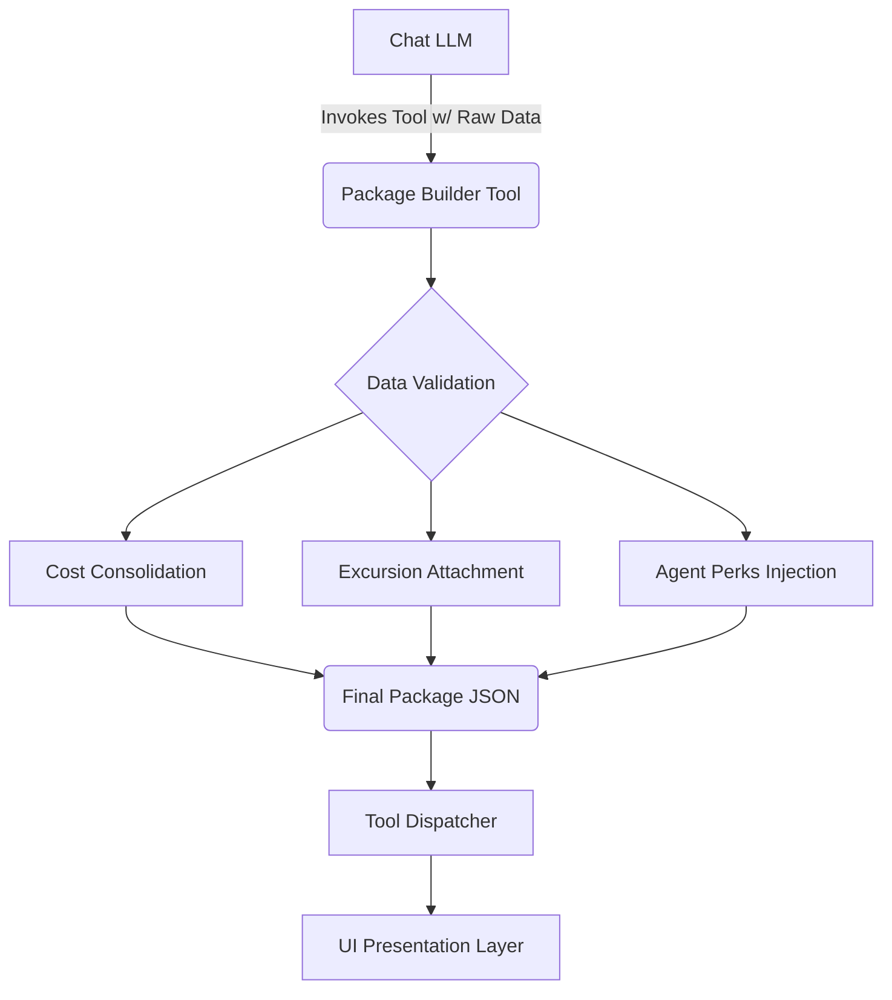

# Package Builder Blueprint (Tool #6)

## 1. Overview & Purpose
The **Package Builder** is the final and most complex tool in the Leisure Life Interactive Chat System suite. It resides in the `tools/construction/` categorization.

While research tools (Odysseus Search, Cruise Brothers Scraper) find raw data, the **Package Builder** acts as the synthesis engine. It takes raw cruise itineraries, aligns them with the user's budget (via the Pricing Comparator logic), optionally attaches excursions (via Excursion Finder), and formats everything into a structured, highly-curated JSON "Package" that the frontend UI can render beautifully.

## 2. Architecture



## 3. Tool Definition (`package-builder.json`)

**Location**: `lib/chat/prompt-data/tools/construction/package-builder.json`

The JSON definition will instruct the LLM to call this tool ONLY when it has gathered enough raw data (a selected cruise, passenger counts, and optional add-ons) and is ready to generate the final proposal for the user.

```json
{
  "tool_id": "package_builder",
  "display_name": "Cruise Package Builder",
  "description": "Synthesizes raw cruise data, passenger counts, taxes, and optional excursions into a finalized, bookable package object for UI presentation.",
  "handler": "lib/chat/tools/package-builder.ts",
  "available_in_contexts": [
    "fast_booking.package_presentation"
  ],
  "input_schema": {
    "cruiseDetails": {
      "itineraryId": "string",
      "shipName": "string",
      "sailDate": "string",
      "baseFare": "number",
      "taxesAndFees": "number"
    },
    "guests": {
      "count": "number",
      "ages": "number[]"
    },
    "includedExcursions": [
      {
        "excursionId": "string",
        "pricePerPerson": "number"
      }
    ],
    "appliedPerks": "string[]"
  },
  "output_schema": {
    "packageId": "string",
    "totalPackagePrice": "number",
    "pricePerPerson": "number",
    "depositRequired": "number",
    "lineItems": "array",
    "presentationReady": "boolean"
  },
  "thoughts_stream_label": "Assembling your custom cruise package..."
}
```

## 4. Handler Logic (`package-builder.ts`)

The handler will be a purely computational/formatting script (similar to the Pricing Comparator, but focused on data structuring rather than simple budget math).

**Core Responsibilities:**
1.  **Math Consolidation**: Calculate the strict totals. `(Base Fare + Taxes) * Guests + (Excursions * Guests)`.
2.  **Deposit Calculation**: Apply standard Cruise Brothers/Vendor rules to calculate the immediate deposit required to lock the rate (e.g., $250/pp standard, or a promotional reduced deposit).
3.  **Unique ID Generation**: Generate a temporary `packageId` (e.g., `PKG-8A9B2`) that the system can hold in session memory.
4.  **Formatting**: Construct a `lineItems` array so the frontend receipt/invoice component can easily map over the data without doing any complex logic itself.

## 5. Integration into the Pipeline

1.  **Context**: This tool will be restricted primarily to the `fast_booking.package_presentation` context. The LLM shouldn't try building packages during early discovery.
2.  **UI Handoff**: The output of this tool isn't just a text string. The `Tool Dispatcher` will recognize the `package_builder` output and attach the raw JSON payload to a specialized `<PackageCard>` or `<ProposalInvoice>` React component injected into the chat stream.

## 6. Implementation Steps

1.  **Create JSON Schema**: Define the inputs and outputs strictly in `prompt-data/tools/construction/package-builder.json`.
2.  **Draft Handler**: Write `lib/chat/tools/package-builder.ts` with robust Zod validation for the incoming data to ensure the LLM doesn't pass in hallucinated math.
3.  **Wire Dispatcher**: Add the switch case in `tool-dispatcher.ts` to execute the builder and format the markdown/component response.
4.  **Test Endpoint**: Build `/api/tests/package-builder` to verify the math and JSON structure.
