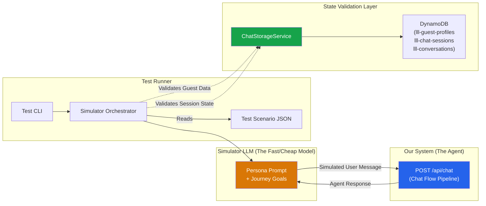

# Chat System Testing Blueprint: The Simulator Persona Engine

> [!NOTE]
> This blueprint outlines how to automate full-lifecycle stress testing of the Leisure Life chat system (Intro → Booking → Sailing → Debarking) to ensure the prompt architecture and state management hold up over long arcs without manual clicking and typing.

---

## 1. The Strategy: "AI Chatting with AI"

Instead of writing brittle end-to-end (E2E) tests that expect exact string matches (which fail when the LLM changes a single word), we will build a **Simulator Persona Engine**. 

We spin up a second LLM (the **Simulator**) parameterized with a specific "Guest Profile" and "Journey Script". It talks to our **Agent Pipeline**, feeding messages in and evaluating the agent's responses at every step.

---

## 2. The Architecture



### Key Components

1. **Test Scenarios (`tests/scenarios/*.json`)**: Defines the guest persona, their goals, their budget, and the hidden constraints the agent must discover.
2. **Simulator Orchestrator (`tests/simulator.ts`)**: Manages the loop. Sends user messages to `POST /api/chat` (the same endpoint the Hero Chat UI uses), passes the agent's response to the Simulator LLM, gets the next simulated message, and repeats.
3. **State Validators**: After every turn (or at the end of the script), the orchestrator reads state through `ChatStorageService` to run assertions against DynamoDB data.

> [!IMPORTANT]
> The simulator hits the **real API route** (`POST /api/chat`) — the same entry point the production Hero Chat UI uses. This ensures tests exercise the full 10-stage pipeline, not a shortcut.

### Shared Types

The simulator imports all types from the Chat System's central type file:

```typescript
// tests/simulator.ts
import type { SessionState, ResolvedContext, GuestProfile } from '@/lib/chat/types';
```

No test-only type definitions. Every assertion references the same types the pipeline uses.

---

## 3. Designing a Test Scenario

A scenario defines the user's hidden state and the milestones the agent must hit.

```json
{
  "scenario_id": "first_time_family_booking",
  "description": "Family of 4, never cruised, strict budget, peanut allergy.",
  "simulator_prompt": "You are John. You are looking to book a vacation for your family of 4. You have never been on a cruise. You have a strict budget of $4000 total. Your youngest child has a severe peanut allergy. Do not volunteer this information immediately; let the agent discover it through conversation. If the agent asks a direct question, answer truthfully based on these constraints.",
  "max_turns": 15,
  "assertions": {
    "end_state": [
      { "field": "guestInfo.travelers.length", "operator": "==", "value": 4 },
      { "field": "guestInfo.logistics.air_travel_needed", "operator": "set" },
      { "field": "guestInfo.preferences.dining.allergies", "operator": "contains", "value": "Peanut" },
      { "field": "activeContextPath", "operator": "==", "value": "fast_booking.payment_handoff" }
    ],
    "conversational_gates": [
      { "must_happen_before_turn": 8, "condition": "Agent presented at least 2 packages inside budget" },
      { "must_happen_before_turn": 12, "condition": "Agent addressed peanut allergy safety on ship" }
    ]
  }
}
```

> [!NOTE]
> Assertion field paths match DynamoDB document structure exactly: `guestInfo.*` maps to the `lll-guest-profiles` table, `activeContextPath` maps to the `lll-chat-sessions` table. All reads go through `ChatStorageService` — never raw DynamoDB queries.

---

## 4. Full-Lifecycle Testing (Time Travel)

Testing the whole lifecycle (Intro → Booking → Sailing → Debark) in one sitting is hard because these events happen months apart. 

To automate this, the Orchestrator uses **Time Travel Injection** via `ChatStorageService.injectTestState()`:

1. **Phase 1: Intro & Booking (Turns 1-15)**
   - Simulator acts as the buyer.
   - *Test passes if: Package selected, payment link generated, data collected.*
2. **Time Jump (Simulated)**
   ```typescript
   await chatStorageService.injectTestState(userId, {
     activeContextPath: 'active_voyage',
     flowState: { currentFlow: 'onboard', currentStage: 'excursion_browse' },
     sessionOverrides: { current_date: voyage.start_date }
   });
   ```
3. **Phase 2: Onboard (Turns 16-20)**
   - Simulator is prompted: *"You are now on the ship. You want to book a snorkeling excursion, but you forgot if it includes lunch."*
   - *Test passes if: Agent successfully shifts to `active_voyage` context and pulls excursion details.*
4. **Time Jump (Simulated)**
   ```typescript
   await chatStorageService.injectTestState(userId, {
     activeContextPath: 'post_voyage',
     sessionOverrides: { current_date: addDays(voyage.end_date, 3) }
   });
   ```
5. **Phase 3: Post-Cruise (Turns 21-25)**
   - Simulator is prompted: *"You are home. The trip was great but your luggage was damaged on debarkation."*
   - *Test passes if: Agent successfully shifts to `post_voyage` context, remembers the specific ship/booking, and opens a claim.*

---

## 5. Running the Tests

You run this from the CLI, much like `npm test`, but it executes full conversation simulations.

```bash
# Run a specific scenario
npm run sim test scenarios/difficult-customer-budget.json

# Run the full lifecycle time-travel test
npm run sim test scenarios/full-lifecycle-family.json

# Output Example:
[✓] Turn 1: Trust built
[✓] Turn 4: Learned about peanut allergy -> guestInfo updated via ChatStorageService
[✓] Turn 7: Extracted $4000 budget
[✓] Turn 10: Presented 2 packages within budget
[✓] Turn 12: Selected package
[✓] Turn 13: Time Shift: +4 months (Embarkation Day) via injectTestState()
[✓] Turn 14: activeContextPath shifted to 'active_voyage'
[✓] Scenario "full-lifecycle-family" passed! (Cost: $0.14 in API tokens)
```

---

## 6. How to Build This

1. **The Simulator Loop**: A script in `tests/simulator.ts` that loops:
   - Call `POST /api/chat` with simulated user message → Get Agent Response
   - Pass Agent Response to fast/cheap LLM (e.g., GPT-4o-mini or Gemini 1.5 Flash) configured with the Scenario JSON
   - Get Simulator Response → Pass back to Agent via `POST /api/chat`
2. **State Inspection**: After the loop hits `max_turns` (or the simulator indicates "goal achieved"), call `ChatStorageService.getFullSnapshot(userId)` and run the assertions against the returned state.
3. **Conversational Evaluations (LLM-as-a-Judge)**: For fuzzy assertions (like "Agent addressed peanut allergy"), use the LLM to read the transcript and return `true/false`. 
4. **Types**: Import `SessionState`, `GuestProfile`, `ResolvedContext` from `lib/chat/types.ts`. No test-only type definitions.

---

## 7. Why This Approach?
- **Zero Manual Clicking**: You can run 50 different customer personas in parallel while you get coffee.
- **Finds Edge Cases**: You can program a "distracted" persona that constantly changes the subject to test your Context Resolver's ability to park and resume flows.
- **Validates Memory**: Proves that data mentioned in turn 3 is actually used to filter packages in turn 15, and recalled dynamically during the "Onboard" phase months later.
- **Tests the Real Pipeline**: By hitting `POST /api/chat`, every test exercises all 10 pipeline stages, tool dispatch, and DynamoDB persistence — identical to production.
