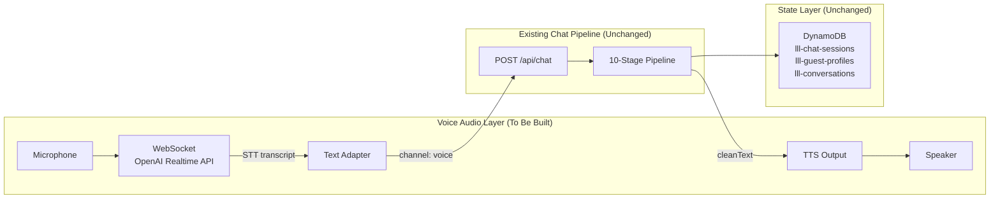
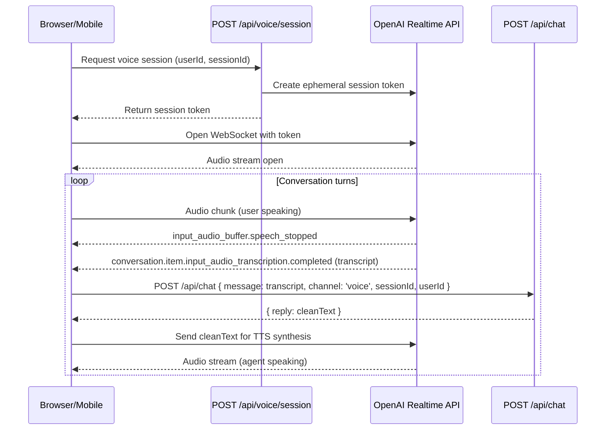

# Voice Pipeline Blueprint: Option B — Pipeline-First Architecture

> [!NOTE]
> **Preliminary spec.** The audio transport layer (OpenAI Realtime API integration) will be completed separately following established documented procedures. This spec defines the architectural contract between the voice audio layer and the existing chat pipeline.

---

## 1. Core Principle

The existing 10-stage chat pipeline (`lib/chat/pipeline.ts`) runs **identically** for voice and text. The Realtime API is used **only for audio transport** — Speech-to-Text (STT) inbound, Text-to-Speech (TTS) outbound. It never replaces the pipeline.

```
Text Channel:   User types   → POST /api/chat → Pipeline → cleanText → Hero Chat UI
Voice Channel:  User speaks  → STT (Realtime) → POST /api/chat → Pipeline → cleanText → TTS (Realtime) → Speaker
```

Everything the pipeline produces — memory extraction, context resolution, tool dispatch, DynamoDB writes — works identically regardless of channel.

---

## 2. Architecture



### Key Contract Points

| Boundary | What Crosses It | What Does NOT Cross |
|----------|----------------|---------------------|
| STT → Pipeline | `transcript` as `message`, `channel: 'voice'` | Raw audio, confidence scores |
| Pipeline → TTS | `reply` (`cleanText` — directive-free) | `display` object, `[Mood:]`, `[Image:]`, `[Form:]` directives |
| Pipeline → DynamoDB | All state writes — identical to text | Nothing voice-specific |

---

## 3. What the Pipeline Already Handles for Voice

No changes needed to the pipeline for voice. These are already in place:

- **`channel: 'voice'`** flows through `runPipeline()` → `assembleSystemPrompt()` — instructs the LLM to keep responses concise for audio playback
- **`response-parser.ts`** strips all display directives (`[Mood:]`, `[Image:]`, `[Form:]`) before returning `cleanText` — TTS only ever receives clean prose
- **`ChatStorageService`** — session/profile/conversation persistence is channel-agnostic
- **Tool dispatch** — runs identically; tool results are woven into `cleanText` just as for text

---

## 4. What Needs to Be Built (Audio Layer)

> [!NOTE]
> Implementation of this section will follow documented procedures to be applied later.

### 4.1 — WebSocket Voice Session Manager

```
lib/voice/
├── realtime-session.ts      # OpenAI Realtime API WebSocket lifecycle
├── audio-adapter.ts         # PCM/opus audio chunking for the WebSocket
├── transcript-handler.ts    # Converts STT transcript events → POST /api/chat calls
└── tts-streamer.ts          # Receives cleanText → streams TTS audio back to client
```

### 4.2 — Voice API Route

```
app/api/voice/
├── session/route.ts         # POST — creates a Realtime session, returns session token
└── webhook/route.ts         # WebSocket upgrade handler (or relay endpoint)
```

### 4.3 — Session Handshake Flow



### 4.4 — Prompt Injection at Session Start

The Realtime API session is initialized with the assembled system prompt (Stage 5 output). This keeps the LLM's persona and channel instructions consistent even if Realtime's own model is used for TTS response generation in future iterations.

```typescript
// Pseudocode — detail to be filled during implementation
const { systemPrompt } = await assembleSystemPrompt({ channel: 'voice', ... });
await realtimeSession.updateSession({ instructions: systemPrompt });
```

---

## 5. Simulator Coverage

The existing `tests/simulator.ts` already tests voice conversation logic by sending `channel: 'voice'` — the full pipeline runs, assertions validate DynamoDB state. **Audio transport is not tested by the simulator** (it is UI/hardware layer).

To add a voice scenario:
1. Add `"channel": "voice"` to the scenario JSON
2. The simulator passes it through `callChatApi()` — pipeline runs with voice channel flag
3. Assert that `reply` contains no markdown or directive syntax (future assertion type: `no_markdown`)

---

## 6. Open Questions (To Resolve During Implementation)

- **Interruption handling** — User speaks while agent is mid-TTS. Realtime API supports this natively; need to decide if pipeline state is rolled back or a new turn is appended.
- **Turn detection sensitivity** — Realtime API's VAD (Voice Activity Detection) threshold tuning for cruise call center background noise.
- **Session persistence** — Realtime WebSocket sessions are ephemeral. The `sessionId` passed to `/api/chat` is the durable identity; Realtime session tokens are disposable.
- **Model selection** — Current pipeline uses `gpt-4o-mini` for chat completions. Realtime API uses `gpt-4o-realtime-preview`. For Option B these are separate: pipeline keeps `gpt-4o-mini`, Realtime handles audio only.

---

## 7. References

- [Chat System Blueprint](./CHAT_SYSTEM_BLUEPRINT.md) — Full pipeline architecture
- [Testing System Blueprint](./TESTING_SYSTEM_BLUEPRINT.md) — Simulator Persona Engine
- `lib/chat/pipeline.ts` — The pipeline this spec wraps
- `lib/chat/response-parser.ts` — Directive stripping (`cleanText` contract)
- `lib/chat/prompt-assembler.ts` — `channel` flag handling (line 71-73)
